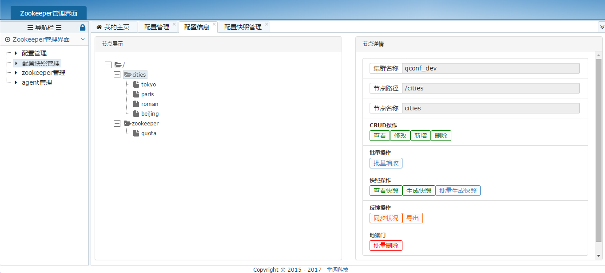
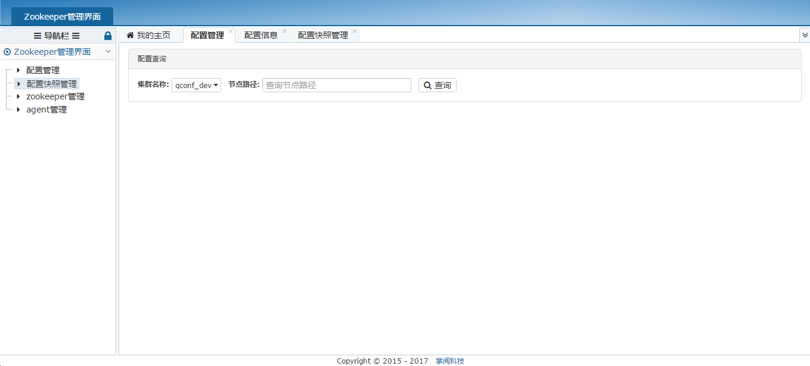
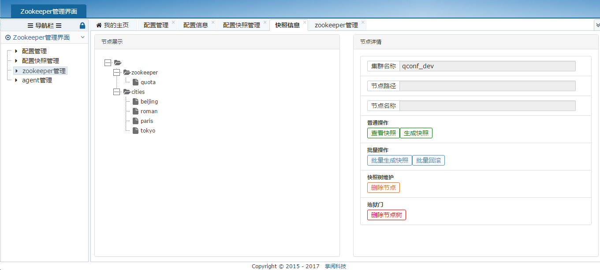
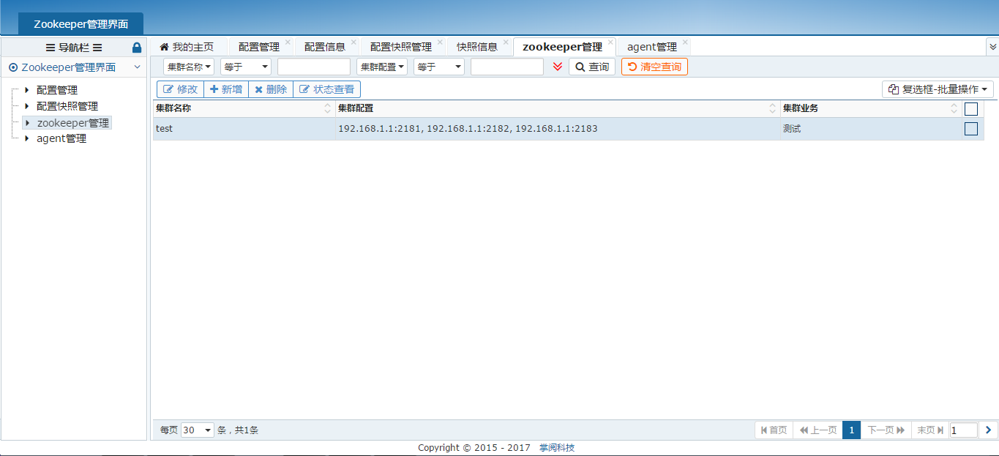

# zkdash
zkdash是一个zookeeper的管理界面，也可以作为任何基于zookeeper的配置管理项目比如：Qconf

### zkdash页面展示










### 安装与运行
安装步骤

 - 安装并运行mysql
 
 - 安装python2.7

 - 下载zkdash
 
       ```
       git clone https://github.com/ireaderlab/zkdash.git
       ```

 - 安装依赖项

    ```
     cd zkdash
     pip install -r requirements.txt
 	```

 - 设置配置文件
 
 	根据需要修改当前目录下./conf/conf.yml中相关配置信息，配置文件详细说明见后面

 - 同步数据库表结构
 
 	```
 	cd zkdash
 	python ./bin/syncdb.py
	```
	说明：数据库使用mysql，创建表结构前请先配置数据库连接信息

 - 运行

    ```
        cd zkdash
	python init.py -port=8888
	```
	说明：初次运行zkdash时需要到zookeeper管理菜单下增加监控的zookeeper集群ip信息


### 配置文件说明
配置文件详细说明

数据库配置项(DATABASE)

 - db: 数据库名称
 - host: ip地址
 - port: 端口号
 - user: 用户名
 - passwd: 密码

全局配置项

 - USE_QCONF: 是否通过QConf获取zookeeper数据（使用该项可以提高树形展示配置信息的响应速度）


### 与QConf的搭配使用

 - 反馈服务器地址：http://ip:port/api/v1/feedback（Agent同步状况查看依赖此反馈信息）


### 注意事项
 1. 新增节点需要先指定父节点，并且只能逐级增加
 2. 当设置使用QConf获取zookeeper数据时，zookeeper管理菜单下的zookeeper集群名称需要与QConf
    客户端Agent配置文件的idc名称一致
